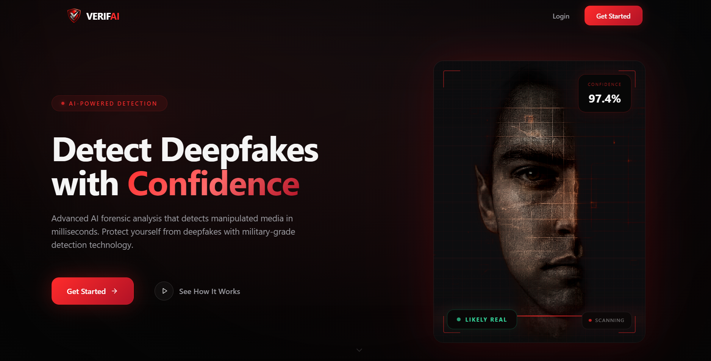
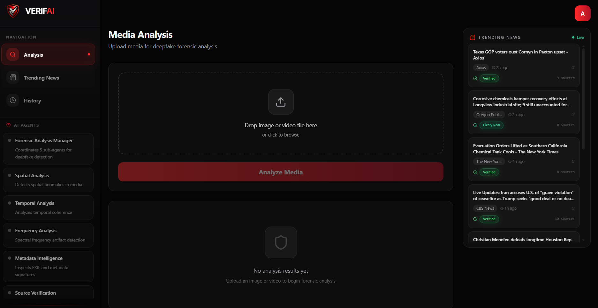
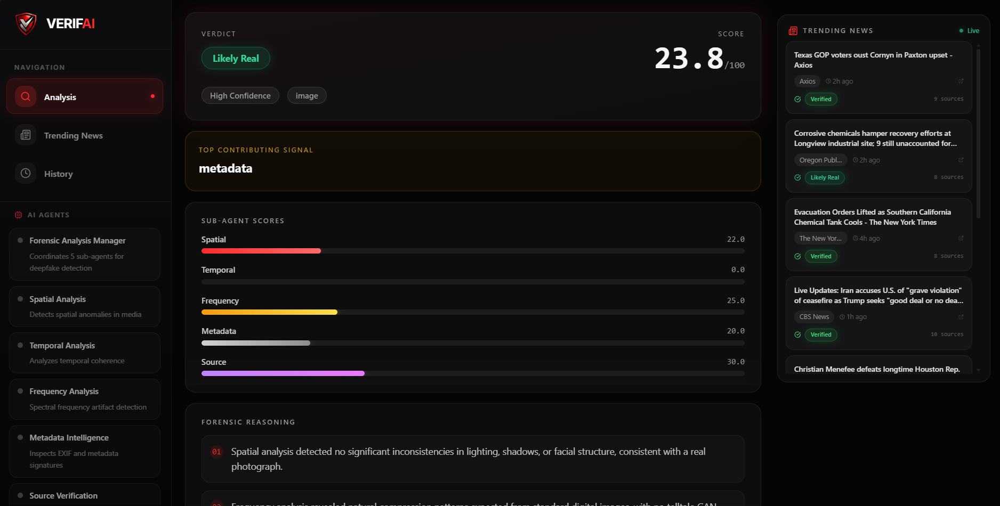
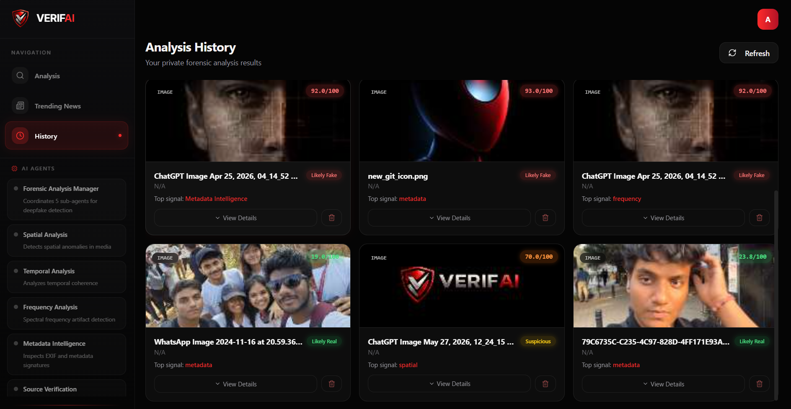

# VerifAI — AI-Powered Deepfake Detection & Media Forensics Platform

**Live Demo:** [https://forensic-lens-mega-forge-86fo.architect.space](https://forensic-lens-mega-forge-86fo.architect.space)

---

## Use Case

Misinformation and manipulated media are growing threats across news, social media, and digital communications. VerifAI addresses this by providing **forensic-grade deepfake detection** powered by a multi-agent AI system.

**Who it's for:**
- Journalists and newsrooms verifying media authenticity before publishing
- Fact-checkers and researchers analyzing suspicious images/videos
- Legal and compliance teams authenticating digital evidence
- Social media moderators flagging manipulated content
- Anyone who wants to verify whether an image or video is real or AI-generated

**What it does:**
- Upload any image or video and receive a detailed forensic analysis in seconds
- Get a confidence score (0-100) with classification: Likely Real, Inconclusive, Suspicious, or Likely Fake
- View breakdown across 5 forensic dimensions — spatial, temporal, frequency, metadata, and source verification
- Track trending investigations and see what media is being analyzed most
- Browse a live news feed with AI-generated credibility scores for each article

---

## Architecture

```
+---------------------------------------------------+
|                   CLIENT (Next.js)                 |
|                                                    |
|  Landing Page  |  Analysis  |  History  | Trending |
|                |  Section   |  Page     | Page     |
+--------+-------+-----+------+----+------+----+-----+
         |             |           |           |
         v             v           v           v
+---------------------------------------------------+
|              NEXT.JS API ROUTES                    |
|                                                    |
|  /api/upload   /api/agent   /api/analyses          |
|  /api/auth/*   /api/news    /api/trending          |
+--------+-------+-----+------+----+-----------------+
         |             |           |
         v             v           v
+----------------+  +--------+  +-------------------+
| Lyzr AI Agent  |  |MongoDB |  |External News APIs |
| Platform       |  |Database|  |(Google RSS,        |
|                |  |        |  | DuckDuckGo)        |
+-------+--------+  +--------+  +-------------------+
        |
        v
+---------------------------------------------------+
|          MULTI-AGENT FORENSIC PIPELINE             |
|                                                    |
|              +------------------+                  |
|              | Manager Agent    |                  |
|              +--------+---------+                  |
|                       |                            |
|    +--------+---------+---------+---------+        |
|    v        v         v         v         v        |
| Spatial  Temporal  Frequency  Metadata  Source     |
| Analysis Analysis  Analysis   Intel     Verify    |
+---------------------------------------------------+
```

### Tech Stack

| Layer          | Technology                                          |
|----------------|-----------------------------------------------------|
| Frontend       | Next.js 14, React 18, TypeScript, Tailwind CSS      |
| UI Components  | Radix UI, Lucide React icons, Recharts              |
| Backend        | Next.js API Routes (serverless)                     |
| Database       | MongoDB with Row-Level Security via `lyzr-architect`|
| Authentication | JWT-based auth with `lyzr-architect`                |
| AI Engine      | Lyzr Multi-Agent Platform (5 specialized sub-agents)|
| News Feed      | Google News RSS + DuckDuckGo scraping                |

### How the Analysis Works

1. **Upload** — User uploads an image or video via drag-and-drop
2. **Submit** — File is sent to the Lyzr asset API; a forensic task is dispatched to the Manager Agent
3. **Analyze** — The Manager Agent coordinates 5 sub-agents in parallel, each examining a different forensic dimension
4. **Poll** — Client polls with adaptive backoff (300ms to 3s) until results are ready
5. **Report** — A comprehensive forensic report is generated with scores, classification, and detailed reasoning
6. **Persist** — Results are saved to the user's analysis history in MongoDB

### Key Directories

```
app/
  api/           API routes (agent proxy, upload, auth, CRUD)
  sections/      Page sections (Landing, Analysis, History, Trending, etc.)
  page.tsx       Main app entry point

lib/             Client utilities (agent wrapper, JSON parser, fetch wrapper)
models/          MongoDB schemas (Analysis, Trending)
components/      Reusable UI components (shadcn/ui based)
```

---

## Screenshots

### Landing Page


### Forensic Analysis Dashboard


### Analysis Results


### Analysis History


---

## Getting Started

```bash
# Install dependencies
npm install

# Set environment variables
cp .env.example .env.local
# Add your LYZR_API_KEY and DATABASE_URL

# Run development server
npm run dev
```

Open [http://localhost:3000](http://localhost:3000) to view the app locally.

---

## Environment Variables

| Variable       | Description                              |
|----------------|------------------------------------------|
| `LYZR_API_KEY` | API key for the Lyzr AI Agent platform   |
| `DATABASE_URL` | MongoDB connection string                |

---

## License

This project is proprietary. All rights reserved.

---

Built with [Lyzr Architect](https://www.lyzr.ai)
